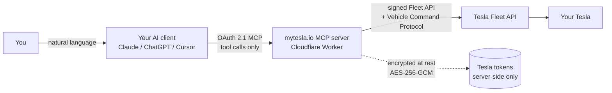

# Architecture & Trust Boundaries

This describes where your prompts go, where Tesla tokens live, and which parties
can see what. The goal is to make the trust boundaries explicit.

## Request flow



Plain-text version:

```
You → [your AI client] → (OAuth 2.1 MCP: tool calls only) → [mytesla.io server]
     → (signed Fleet API) → [Tesla] → [your car]

Tesla tokens live ONLY in the mytesla.io server, encrypted at rest.
They never travel back to the AI client.
```

## Trust boundaries — who sees what

| Party | Sees your prompt? | Sees Tesla tokens? | Can command the car? |
|---|---|---|---|
| **Your AI client** (Claude/ChatGPT/Cursor) | Yes — it's your assistant | **No** | Only by calling one of the 40 tools |
| **mytesla.io server** | No — only the resulting tool calls | Yes — held server-side, encrypted | Yes, within your approved Tesla scope |
| **Tesla** | No | Issues them | Executes signed commands |

Key points:

- **Prompts** are interpreted by *your* AI client. mytesla.io receives the
  structured tool call it decides to make (e.g. `set_charge_limit(80)`), not the
  free-text conversation.
- **Tesla tokens** are minted via Tesla's OAuth flow and stored **only** on the
  mytesla.io server, encrypted. They are **never** returned to the AI client or
  sent over the MCP channel.
- **Commands** are signed requests through Tesla's official Fleet API and
  Vehicle Command Protocol — the same secured path Tesla's own app uses. No
  scraped session tokens, no unofficial API.

## Failure & abuse containment

- The MCP session is OAuth-gated and bound to a single user; a client can only
  ever act on that user's own vehicles.
- The exposed tool set is fixed at 40. A prompt cannot cause the server to
  expose new capabilities or exceed the Tesla-approved scope.
- PIN-protected actions (Valet, speed limit) require the user's PIN, which the
  server does not hold on the AI's behalf.
- Access is revocable instantly from the user's Tesla account (see
  [`SECURITY.md`](./SECURITY.md#revocation--youre-always-in-control)).
