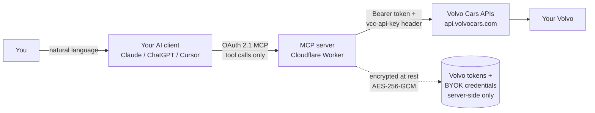

# PRD — Volvo Companion MCP Server (working name: TBD)

**The Volvo sibling of mytesla.io.** A hosted [Model Context Protocol](https://modelcontextprotocol.io)
server that lets an AI assistant (Claude, ChatGPT, Cursor, VS Code, or any MCP client) read a
Volvo's status and send it commands through **Volvo Cars' official Connected Vehicle, Energy, and
Location APIs** — in plain English.

| | |
|---|---|
| **Operator** | Embay, LLC |
| **Working name** | _TBD_ — "volvo.io" / "myvolvo.io" is flagged **high-risk** and recommended against (§11); candidates proposed there |
| **Upstream** | Volvo Cars Developer Portal: Connected Vehicle API v2 · Energy API v2 · Location API v1 |
| **Transport** | Streamable HTTP MCP endpoint, OAuth 2.1 + dynamic client registration (RFC 7591) — identical to mytesla.io |
| **Tool count** | **19 fixed tools** — no drive tool, and (by Volvo API design) **no charging control** |
| **Credential model** | **BYOK-first**: each user brings their own Volvo API application (private 10k/day quota — "your key, your quota, your kill switch") |
| **Markets at launch** | EMEA + US/Canada — a subset of Volvo's production regions (LatAm deferred to Phase 2; **no APAC exists upstream**) |
| **Research basis** | Deep-dive of developer.volvocars.com content, triangulated 2026-07-29 (portal not directly fetchable — see Appendix E): Volvo's own OpenAPI spec, Volvo's official sample repo, and production clients (official Home Assistant `volvo` integration, evcc, homebridge-volvoEX30, volvo2mqtt). Confidence labels carried through; unverified items are marked and collected in §15. |

**The honest headline:** Volvo's public API is **read-rich and command-poor**. Only 10 of mytesla's
40 tools survive the port; 30 are infeasible upstream (§4). There is no charging control, no
granular climate, no window/trunk actuation, no nav-send, no OTA tools, no wake command, and no
streaming — polling reads plus 10 commands. This product therefore leans into Volvo's strengths:
**rich charging/energy state, diagnostics & service-due data, warnings, location, lock/unlock,
climate on/off, honk/flash** — surfaced through the same trusted MCP experience as mytesla.io.

---

## 1. Product summary

Volvo owners connect their car once, then talk to it through the AI assistant they already use:

> "Is the car locked? … Lock it." · "How charged is the EX40, and when will it hit the target?" ·
> "Warm the car up." · "Where did I park?" · "Anything wrong with the car? When is service due?"

Same product thesis as mytesla.io: the assistant is the interface; we are the secure, auditable
bridge. Official APIs only, no scraped endpoints, tokens never leave the server, everything
revocable by the user at any time. Not affiliated with Volvo Cars — an independent service built
on Volvo's official developer APIs, with nominative "works with Volvo cars" positioning only (§11).

Two structural constraints shape everything below and are treated as design inputs, not surprises:

1. **Quota:** every Volvo API application gets ~10,000 requests/day. → BYOK-first credential
   model (§6.1, §8) so each user brings their own private quota.
2. **Re-auth:** self-published Volvo apps have a ~7-day refresh-token grant. → keepalive refresh
   job + graceful re-auth UX (§6.3), partner track to remove it (§12).

## 2. Goals / non-goals

### Goals

- Feature-parity *in experience* with mytesla.io wherever Volvo's API allows: status, location,
  lock/unlock, climate on/off, find-my-car, plus Volvo-unique depth (diagnostics, warnings, trip
  statistics, rich charging reads).
- Identical trust properties: server-side encrypted tokens, fixed tool manifest, MCP-standard
  read-only/destructive annotations, instant revocation, public spec repo.
- Sub-second cached reads; graceful degradation when the car is asleep, privacy-locked, or the
  user under-consented scopes.
- Ship without waiting on Volvo: BYOK works today with zero Volvo business development.

### Non-goals (pre-refused scope — the API cannot do these)

| Not in scope | Why (API citation) |
|---|---|
| Charge start/stop, charge limit, charging amps, charge-port, charging schedules | Energy API v2 is exactly two read-only GETs; `targetBatteryChargeLevel` & `chargingCurrentLimit` are read-only mirrors. No charging command exists on any public endpoint (verified against the complete CV v2 OpenAPI surface). Smartcar's paid OEM partner channel got Volvo charge *schedules* in May 2026 — the machinery exists at Volvo, but not on the public portal. Revisit each release-notes cycle. |
| Cabin temperature setpoint, seat heaters/coolers, steering-wheel heat, defrost, climate schedules, climate state readback | Climate is all-or-nothing `climatization-start`/`stop`; no other climate endpoint exists. |
| Window/sunroof venting or closing; trunk/frunk actuation | Status reads only (`GET /windows`, `GET /doors`); no actuation commands. |
| Send destination to nav | `SEND_NAVI_POI` exists in Volvo's command enum but has **no public POST path**. |
| Sentry/dashcam, valet mode, speed limit, HomeLink | No equivalent vehicle features exposed. |
| Software/OTA management | No endpoints. |
| Wake the car | No wake command exists; cars wake on their own schedule (§5.3). |
| Live telemetry, webhooks, trip logs | Polling-only API; no streaming of any kind; statistics are aggregates only. |
| Anything that moves the car | Same hard rule as mytesla.io. |
| APAC markets, Polestar | Volvo production regions are EMEA + Americas only; Polestar is not covered by this portal. |

## 3. Personas & jobs-to-be-done

1. **The EV owner** (EX30/EX40/XC40 Recharge…): "Is it plugged in and charging? What's the SoC and
   range? When does it reach the target? Precondition the cabin." — served by
   `get_charging_status`, `start_climate`.
2. **Family logistics** — "Did anyone lock the car? Where is it parked?" — `get_vehicle_status`,
   `get_vehicle_location`, `lock_vehicle`, `flash_lights`.
3. **The maintenance-minded owner** — a **Volvo-unique strength**: "Distance/time to next service,
   engine hours, washer fluid, oil & coolant warnings, brake fluid, bulb failures, tyre warnings"
   — `get_vehicle_diagnostics`, `get_vehicle_warnings`. Tesla's API has nothing this rich.
4. **The existing mytesla.io user with a Volvo in the driveway** — same connector UX, same trust
   story, one more car in the garage.

## 4. Feature parity matrix vs mytesla.io

Disposition of all 40 mytesla tools. **10 kept** (4 as-is: `get_credit_balance`, `honk_horn`,
`flash_lights`, `report_bug`; 6 with changed semantics), **30 cut as upstream-infeasible**,
**9 Volvo-native tools added** (§5) — 10 + 9 = the 19-tool manifest.

| mytesla tool | Disposition | Volvo mapping / reason |
|---|---|---|
| `get_vehicles` | **Kept+** | CV v2 `GET /vehicles` + `/vehicles/{vin}` — gains model year, fuel type, battery kWh, colour, images, per-VIN capability summary |
| `get_vehicle_status` | **Kept~** | Sectioned, cached composite of up to 13 live GETs (§5.2); no climate-state readback exists |
| `get_credit_balance` | **Kept** | Product-side |
| `wake_vehicle` | **Cut → replaced** | No wake command; replaced by `check_vehicle_reachability` |
| `start_climate` / `stop_climate` | **Kept~** | All-or-nothing `climatization-start/stop`; no setpoint; EX30 quirk (§5.4) |
| `set_cabin_temperature` | Cut | No setpoint endpoint |
| `max_defrost` | Cut | No endpoint |
| `set_seat_heater` / `set_seat_cooler` | Cut | No per-seat control |
| `set_steering_wheel_heater` | Cut | No endpoint |
| `set_climate_keeper_mode` | Cut | No equivalent |
| `set_cabin_overheat_protection` | Cut | No endpoint |
| `start_charging` / `stop_charging` | **Cut → replaced (read)** | No charging control; replaced by `get_charging_status` |
| `set_charge_limit` | Cut | `targetBatteryChargeLevel` read-only (absent on EX30) |
| `set_charging_amps` | Cut | `chargingCurrentLimit` read-only |
| `open_charge_port` / `close_charge_port` | Cut | No endpoint |
| `set_scheduled_charging` / `set_scheduled_departure` | Cut | No endpoint (Smartcar partner channel only) |
| `lock_vehicle` | **Kept+** | `POST /commands/lock`; gains `reduced_guard` option |
| `unlock_vehicle` | **Kept~** | Volvo unlock opens a **time window** (`readyToUnlock`/`readyToUnlockUntil`) — user pulls a handle within it (§5.4) |
| `actuate_trunk` | Cut | Tailgate/hood status only |
| `control_windows` / `sun_roof_control` | Cut | Status reads only |
| `honk_horn` | **Kept** | `POST /commands/honk` |
| `flash_lights` | **Kept** | `POST /commands/flash`; plus new `honk_and_flash` |
| `share_destination` | Cut | `SEND_NAVI_POI` has no public POST path |
| `trigger_homelink` | Cut | No equivalent |
| `set_sentry_mode` | Cut | No equivalent |
| `set_valet_mode` / `reset_valet_pin` | Cut | No equivalent |
| `set_speed_limit` / `speed_limit_activate` / `speed_limit_deactivate` / `speed_limit_clear_pin` | Cut | No equivalent |
| `schedule_software_update` / `cancel_software_update` | Cut | No OTA endpoints |
| `report_bug` | **Kept** | Product-side |

New Volvo-native tools (9, no mytesla equivalent): `get_charging_status`, `get_vehicle_location`,
`get_vehicle_diagnostics`, `get_vehicle_warnings`, `get_trip_statistics`,
`check_vehicle_reachability`, `honk_and_flash`, `start_engine`, `stop_engine`.

## 5. Tool manifest — 19 fixed tools

Annotation scheme identical to mytesla.io's `TOOLS.md`: **read-only** (`readOnlyHint: true`),
**write** (reversible, low-consequence), **write · sensitive** (`destructiveHint: true` — grants
physical access or is security-relevant). The set is fixed; a prompt cannot cause the server to
expose new capabilities. All inputs validated with strict schemas before any upstream call.
Scope strings below are in addition to `openid`; endpoint paths are relative to
`https://api.volvocars.com`.

### 5.1 Reads (9)

| Tool | Purpose | Params | Upstream | Scopes | Hint |
|---|---|---|---|---|---|
| `get_vehicles` | List the account's Volvos with model details, images, and per-car capability summary | — | `GET /connected-vehicle/v2/vehicles`, `…/vehicles/{vin}`; cached `…/{vin}/commands`, `GET /energy/v2/vehicles/{vin}/capabilities` | `conve:vehicle_relation`, `conve:commands`, `energy:capability:read` | read-only |
| `get_vehicle_status` | Composite live state (§5.2): locks/doors, windows, fuel/battery, range, odometer, engine state, charging summary, location | `vin`, `sections?`, `refresh?` | composite (§5.2) | union of section scopes | read-only |
| `get_charging_status` | Rich EV charging read: SoC, target SoC, range, plug state, charging status/type/power, current limit, est. time-to-target | `vin` | `GET /energy/v2/vehicles/{vin}/state` | `energy:state:read`, `energy:capability:read` | read-only |
| `get_vehicle_location` | Last-known GPS position + heading + timestamp | `vin` | `GET /location/v1/vehicles/{vin}/location` | `location:read` | read-only |
| `get_vehicle_diagnostics` | Service-due data: distance/time/engine-hours to service, service warning, washer fluid, oil/coolant warnings, brake fluid | `vin` | `GET …/{vin}/diagnostics`, `…/{vin}/engine`, `…/{vin}/brakes` | `conve:diagnostics_workshop`, `conve:diagnostics_engine_status`, `conve:brake_status` | read-only |
| `get_vehicle_warnings` | Active warnings: exterior-light/bulb failures (23 fields) + per-wheel tyre warning states | `vin` | `GET …/{vin}/warnings`, `…/{vin}/tyres` | `conve:warnings`, `conve:tyre_status` | read-only |
| `get_trip_statistics` | Trip meters, average speed/consumption, distance-to-empty, odometer | `vin` | `GET …/{vin}/statistics`, `…/{vin}/odometer` | `conve:trip_statistics`, `conve:odometer_status` | read-only |
| `check_vehicle_reachability` | "Can the car receive commands right now, and which does it support?" — the Volvo replacement for `wake_vehicle` | `vin` | `GET …/{vin}/command-accessibility`; cached `…/{vin}/commands` | `conve:command_accessibility`, `conve:commands` | read-only |
| `get_credit_balance` | Remaining product credits | — | internal | — | read-only |

*Notes:* tyre data is **warning states only** — Volvo exposes no PSI/kPa values; the tool
description says so, so the assistant never promises pressures. On the **EX30**, target-SoC and
current-limit fields are unsupported — `get_charging_status` returns them as `unsupported` per
§5.5 and still answers SoC/range/charging state (time-to-target is omitted when no target exists).

### 5.2 `get_vehicle_status` composition (the quota-critical tool)

Sectioned fan-out with per-section caching. Default call = `summary` only.

| Section | Upstream endpoints | Cache TTL | Class |
|---|---|---|---|
| `summary` *(default)* | `/doors` (locks+doors), `/fuel`, energy `/state` (EV-capable cars), `/engine-status` | 90 s; energy adaptive — 60 s while `chargingStatus=CHARGING`, 10 min otherwise | live |
| `access` | `/doors`, `/windows` | 90 s | live |
| `energy` | energy `/state` | adaptive (above) | live |
| `location` | location `/location` | 60 s | live |
| `trip` | `/odometer`, `/statistics` | 15 min | slow |
| `health` | `/diagnostics`, `/engine`, `/brakes`, `/warnings`, `/tyres` | 4 h | slow |
| *(implicit)* | `/vehicles/{vin}` details, `/commands`, energy `/capabilities` | 24 h | static |

Rules:

- `sections: ["all"]` fans out to everything, budget-metered. `refresh: true` bypasses cache
  (still budget-metered).
- **Capability gating:** skip energy for ICE-only cars (from cached `/capabilities`); skip
  location when scope/privacy-blocked (learned 403 cached 1 h); skip endpoints that previously
  404'd for the VIN.
- **Request coalescing:** single-flight per `(vin, endpoint)` — concurrent tool calls share one
  upstream fetch.
- **Serve-stale:** if a user's daily budget is exhausted (§8), return cached data with an explicit
  `data_age` field instead of erroring.
- **Timestamps always pass through.** Every datapoint is normalized to `{value, unit?, timestamp}`
  per §5.5 (Energy's `updatedAt` → `timestamp`; per-field `status: ERROR` → `value: null` with
  reason) so the assistant can say "as of 14:02".

### 5.3 Cross-cutting command behavior

1. **Pre-flight reachability.** Every write tool first consults cached `command-accessibility`
   (TTL ≤ 60 s). If the car is unavailable, fail fast with the `unavailableReason` and the message:
   *"Volvo provides no wake command — the car must wake on its own (e.g. someone opens a door or
   the Volvo app connects)."*
2. **`invokeStatus` mapping.** Commands are a single synchronous POST (no async job, no polling
   endpoint) returning the standard envelope with `data = {vin, invokeStatus, message}`
   (Appendix B). The 22-value enum (Appendix C) maps to five §5.5 outcome classes:
   **success** (`COMPLETED/SUCCESS/DELIVERED/SENT`),
   **pending** (`WAITING/RUNNING` → "command accepted — verify with a fresh status read"),
   **asleep/unreachable** (`VEHICLE_IN_SLEEP/CAR_IN_SLEEP_MODE/TIMEOUT/CAR_TIMEOUT/CONNECTION_FAILURE/DELIVERY_TIMEOUT/EXPIRED`),
   **blocked** (`NOT_ALLOWED_PRIVACY_ENABLED` → "check the car's in-car privacy settings";
   `NOT_ALLOWED_WRONG_USAGE_MODE` → "the car is in use/driving"; `NOT_SUPPORTED`;
   `UNLOCK_TIME_FRAME_PASSED`; `UNABLE_TO_LOCK_DOOR_OPEN`), **error** (rest). Raw status included
   in `details.invokeStatus`.
3. **Per-VIN capability gating.** Tools a specific car doesn't support (from its `/commands` list)
   return a structured "not supported by this vehicle" without burning an upstream command call —
   the same pattern the official Home Assistant integration uses.
4. **Command rate limiting.** Product-side limiter well inside Volvo's 10 commands/min per
   user+client; honk/flash get an additional product cooldown (repeated honk/flash has caused
   12 V battery-drain incidents per HA docs).

### 5.4 Climate (2) · Access (2) · Alerts (3) · Engine (2) · Feedback (1)

| Tool | Purpose / notes | Params | Upstream | Scopes | Hint |
|---|---|---|---|---|---|
| `start_climate` | Start cabin climatization — **all-or-nothing; the car chooses the target**. EX30 quirk: has been observed to force AC/cold rather than resume last setting; tool description notes it | `vin` | `POST …/commands/climatization-start` | `conve:climatization_start_stop` | write |
| `stop_climate` | Stop climatization | `vin` | `POST …/commands/climatization-stop` | `conve:climatization_start_stop` | write |
| `lock_vehicle` | Lock the doors | `vin`, `reduced_guard?` (bool → `…/lock-reduced-guard`) | `POST …/commands/lock` | `conve:lock` | write · sensitive |
| `unlock_vehicle` | Put the car in a **ready-to-unlock window** — user must open a door before it expires. Returns `readyToUnlockUntil` as human time ("openable for the next N seconds"); `UNLOCK_TIME_FRAME_PASSED` maps to a retry suggestion | `vin` | `POST …/commands/unlock` | `conve:unlock` | write · sensitive |
| `honk_horn` | Honk the horn (product cooldown) | `vin` | `POST …/commands/honk` | `conve:honk_flash` | write |
| `flash_lights` | Flash exterior lights — find the car | `vin` | `POST …/commands/flash` | `conve:honk_flash` | write |
| `honk_and_flash` | Honk and flash together | `vin` | `POST …/commands/honk-flash` — **build-time check:** spec says `honk-flash`; one production client ships `honk-and-flash`; verify against the live spec | `conve:honk_flash` | write |
| `start_engine` | Remote engine start — **legacy Volvo-On-Call ICE cars only, market-restricted**; hidden for VINs whose `/commands` list omits it (all BEVs, most Google Built-In cars) | `vin`, `runtime_minutes` (int, 0–15, required) | `POST …/commands/engine-start` | `conve:engine_start_stop` | write · sensitive |
| `stop_engine` | Stop a remote-started engine | `vin` | `POST …/commands/engine-stop` | `conve:engine_start_stop` | write |
| `report_bug` | Send feedback to the operator (free, no vehicle action) | `description` | internal | — | write |

### 5.5 Tool result & error envelope (the MCP-facing contract)

MCP `isError` is reserved for product-level failures (invalid params, unauthenticated session).
Everything vehicle-level — degradation, staleness, blocks, command outcomes — is an **in-band
structured result** so the assistant can explain it:

- **Command tools** return `{outcome: "success"|"pending"|"asleep"|"blocked"|"error",
  message: <one-line user-facing>, details: {invokeStatus, ...}}` — `unlock` adds
  `ready_until` (ISO-8601) translated into the message.
- **Composite reads** (`get_vehicle_status`) return per-section objects:
  `{status: "ok"|"stale"|"blocked"|"unsupported"|"error", data, data_age_seconds, reason?}` —
  a privacy-blocked location is `blocked` with a reason, not an omission.
- **Datapoint normalization:** every upstream field becomes `{value, unit?, timestamp}`
  (Energy's `updatedAt` maps to `timestamp`; an Energy field with `status: "ERROR"` or an
  unsupported capability yields `value: null` + `status` passed through in `reason`).
- **Account-level:** `get_vehicles` carries `connection_status` and `reauth_url` (§6.5).

**What is *not* here** (mirroring mytesla's closing statement): no tool steers, accelerates,
brakes, or moves the vehicle — and unlike mytesla, no tool starts, stops, limits, or schedules
charging, because Volvo's public API has no such endpoints. If Volvo ships charging control
(their partner channel already has schedules), it becomes the highest-priority manifest addition.

## 6. UX flows

### 6.0 Onboarding surface & account model (new vs mytesla)

mytesla.io onboards entirely inside OAuth-on-first-connect; BYOK needs a place to paste secrets,
so this product adds a **web dashboard** at the product domain. The model:

- **Account:** created during the MCP OAuth 2.1 first-connect flow — the server-hosted
  authorization page signs the user up (email + passkey/password, email verified). The email
  powers the §6.3 re-auth nudges and the credit ledger. The MCP OAuth grant maps to this account
  ID; **BYOK credentials, Volvo tokens, caches, and budgets are all keyed to it.**
- **Flow ordering (first connect):** MCP client connect → server-hosted authorization page
  (signup/login) → **BYOK wizard** (§6.1) → Volvo ID consent (§6.1 step 6) → redirect back to
  the MCP client with the grant. A user who abandons mid-wizard can resume from the dashboard.
- **Dashboard (logged-in, reachable any time):** BYOK credential entry/rotation, **"re-test my
  connection"** diagnostic (§6.5), re-auth button, connected-cars list, credits/billing (Phase 2),
  data-deletion self-service. The §6.3 "one-line re-auth URL" returned in tool results is a
  deep link into this dashboard.

### 6.1 Onboarding — BYOK wizard (primary flow)

**Positioning: a perk, not a chore.** *"Your key, your quota, your kill switch."* Each user
creates their own Volvo API application, so they get a private ~10,000 requests/day quota,
their car's traffic is never pooled with other users, and deleting their app in Volvo's portal
instantly severs everything. One-time, ~10–15 minutes, proven at scale by the Home Assistant /
evcc / homebridge communities. Guided wizard with screenshots, copy buttons, and per-field live
validation:

1. **Create a developer account** at `developer.volvocars.com` — *sign in with the same Volvo ID
   you already use in the Volvo Cars app* (no new identity).
2. **Create an "API application"** (any name/description). The **VCC API key** (primary +
   secondary) appears immediately — copy the primary into the wizard (validated on paste).
3. **Publish the application** in Volvo's portal: click **Publish** →
   **select ALL scopes — expand every collapsed section** (wizard shows exactly which; **scopes
   freeze at publish**, a missed scope means recreating the app) → paste the **redirect URI the
   wizard displays** (exact-match; copy button) → View summary → confirm.
4. Copy the **`client id` and `client secret`** from Volvo's confirmation page into the wizard.
   The app may display **"Publication under Review" — this is normal and it works immediately**
   (Volvo's publish has been instant/self-service since Jan 2025).
5. **Pre-OAuth validation** — the wizard checks what is checkable *before* consent: credential
   format (key/secret shape, stray whitespace), a probe call distinguishing a bad `vcc-api-key`
   from a missing token, and an authorize-endpoint probe that surfaces redirect-URI mismatches.
6. **Volvo ID login + consent** — Volvo's own browser consent screen, scope-by-scope. Users may
   under-consent; affected tools degrade gracefully rather than failing the session (§7.1).
7. **Post-consent validation** — token exchange success proves the `client_secret`; the wizard
   diffs granted scopes against the expected full list and a first `GET /vehicles` proves
   end-to-end, reporting exactly which credential or scope is broken if anything fails.

No virtual-key ceremony, no in-car approval step — the VIN↔Volvo-ID link made during normal car
onboarding in the Volvo app *is* the pairing. **Simpler than Tesla onboarding.**

Wizard failure modes to design for: collapsed scope sections (most common), redirect-URI
whitespace/mismatch, secret pasted with trailing newline, user's car in an unsupported region,
car not linked to the Volvo ID used.

### 6.2 MCP client connect

Identical to mytesla.io: paste the MCP endpoint URL into Claude / ChatGPT (Developer Mode) /
Cursor / VS Code / `claude mcp add --transport http …`. OAuth 2.1 with dynamic client
registration on first connect. Every MCP request is authenticated as a specific user; no
anonymous access; a client only ever acts on that user's own vehicles.

### 6.3 Re-authentication (the 7-day reality)

Self-published Volvo apps (BYOK included) carry a ~7-day refresh-token grant (§7.3):

- **Keepalive** refresh job runs server-side every 24–48 h per user, which per community evidence
  keeps rotating grants alive indefinitely in most cases — but a hard ~7-day cap has been
  observed for some apps, so the UX assumes worst case.
- **Day-5/6 nudge:** email ("Your Volvo link may expire soon — one click to renew").
- **In-tool recovery:** any tool call on a dead grant returns a one-line re-auth URL in the tool
  result — the assistant relays it, the user clicks, logs in, done. `get_vehicles` also carries a
  per-account `connection_status` flag so the assistant can warn proactively.
- Re-auth completion rate is a first-class metric (§13).

### 6.4 Command failures

Failure UX per §5.3 (asleep / privacy-blocked / driving / unsupported — each with a one-line,
actionable message).

### 6.5 Connection diagnostics (the §14 support-burden mitigation, specified)

Two surfaces name the exact broken thing rather than a generic error:
- **Dashboard "re-test my connection"** re-runs the §6.1 step-5/7 validation suite on demand and
  reports per-item pass/fail (API key, secret, redirect URI, each scope, token freshness,
  per-car reachability).
- **In-band:** `get_vehicles` returns a per-account `connection_status`
  (`ok | reauth_required | credential_invalid:<which> | scope_missing:<scope> | quota_exhausted`)
  plus `reauth_url` when actionable, so the assistant can tell the user precisely what to fix.

### 6.6 Revocation

Revocation trifecta, any of which stops everything instantly:
**(1)** delete the API application in Volvo's developer portal (BYOK kill switch),
**(2)** revoke consent in Volvo ID / in-car privacy settings, **(3)** remove the MCP connector.

## 7. Architecture

Carried over from mytesla.io unchanged: Cloudflare Worker; streamable-HTTP MCP; OAuth 2.1 + RFC
7591 for clients; **AI clients never receive upstream tokens** — tool calls and results only;
tokens AES-256-GCM encrypted at rest, keys in the platform secret store; per-user data isolation;
parameterized queries; strict input schemas; status endpoint + `/.well-known/mcp/server-card.json`.

### 7.1 Volvo ID OAuth (replaces Tesla OAuth + virtual key)

- Authorization-code + **PKCE (S256)** at `https://volvoid.eu.volvocars.com/as/authorization.oauth2`;
  token calls to `…/as/token.oauth2` send **`Authorization: Basic base64(client_id:client_secret)`
  in addition to PKCE** (confidential client — verified against Volvo's sample + production clients).
- Every API call: `Authorization: Bearer <token>` **and** `vcc-api-key: <key>`; recommended
  `accept: application/json`; optional `vcc-api-operationId` (UUID) — attach one per request and
  log it for supportability.
- **BYOK ⇒ per-user OAuth client config.** Each user's `client_id` / `client_secret` /
  `vcc-api-key` is stored encrypted alongside their tokens; the token endpoint is called with
  *that user's* client. No global upstream client exists in MVP.
- **Under-consent tolerance:** consent is scope-by-scope and users may decline some; in-car
  privacy toggles additionally gate data server-side (observed live: 403 "Client not allowed to
  access Location API"). Per-scope 403s degrade only the affected tools with a clear message
  ("you didn't grant location — reconnect to add it"), never the whole session.
- No command signing, no Tesla-style Vehicle Command Protocol, no key ceremony.

### 7.2 Access-token handling

Observed lifetime **299 s** (was 1799 s; Volvo shortened it without an announcement). Rules:
refresh proactively at ~80% of the **runtime `expires_in`** — never hardcode; treat further
changes as expected.

### 7.3 Refresh-token handling (the hard part)

- **Single-use, rotating**: every refresh returns a new refresh token and invalidates the old
  one. A concurrent double-refresh permanently burns the grant → **all refreshes for a user
  serialize through one Durable Object**, and the new token is **persisted transactionally
  before first use**.
- Stale/expired grant → `400 invalid_grant` ("unknown, invalid, or expired refresh token") →
  mark connection dead, trigger §6.3 recovery.
- **~7-day grant**: community evidence splits between "7 days of inactivity if not rotated"
  (keepalive fixes it) and a hard 7-day cap regardless of refreshing (evcc field reports). Design
  for worst case; measure actual grant lifetimes in telemetry from day one (it's cheap and
  settles the question empirically). A "6-month maximum grant lifetime" is claimed by two
  community repos — weak evidence, unverified.
- Volvo **test tokens** (60-minute, portal-generated) power development against the demo car
  before OAuth is wired up.

### 7.4 Capability discovery & regions

- Per-VIN, runtime, cached 24 h: CV `GET /commands` (which commands this car supports), energy
  `GET /capabilities` (which datapoints), learned 403/404s. Gates tool availability, status
  fan-out, and `check_vehicle_reachability` output. Mandatory: EX30/EX90/ES90 all have partial
  surfaces, and engine-start exists only on legacy VOC cars.
- Regions: production coverage EMEA + US/Canada/Latin America; **single global API base and
  EU-only auth host today** (Appendix B) — reference clients model `eu`/`na` regions but no
  regional API host is documented. The stored per-user region hint drives **market-eligibility
  checks and support copy only** (and would select a regional base URL if Volvo ever ships one).
  No APAC.
- Vehicle images/details in reference clients come from an undocumented internal
  `*.volvocars.biz` BFF host — treat images as **best-effort decoration**, never load-bearing.

### 7.6 State map (Cloudflare Workers primitives — isolates share no memory)

| State | Store | Notes |
|---|---|---|
| Accounts, credit ledger, BYOK credentials (encrypted), Volvo tokens (encrypted) | **D1** (SQL) | Row-level per-account; parameterized queries |
| Refresh-token serialization + per-user token state | **Durable Object per account** | The §7.3 single-writer; DO alarm doubles as that user's 24–48 h keepalive timer (no global cron fan-out) |
| Response caches, single-flight coalescing, learned 403/404 capability data, per-user daily budget counters | **Durable Object per VIN** | All upstream fetches for a VIN route through its DO → single-flight is free; TTLs per §5.2; budget check before fetch |
| Static/slow caches shared across sessions (vehicle details, `/commands`, `/capabilities`) | DO storage (per-VIN) with **KV** as optional warm layer | 24 h TTL |
| Grant-lifetime & quota telemetry (aggregate) | Workers Analytics Engine / D1 rollups | Feeds §13 metrics and §7.3's empirical grant question |

### 7.5 Error taxonomy (upstream → product)

| Upstream | Meaning | Product behavior |
|---|---|---|
| 401 (bad/expired token) | token stale | refresh & retry once |
| 401 invalid `vcc-api-key` | BYOK key wrong/revoked | connection-broken flow → wizard |
| 403 per-scope / privacy | consent or in-car privacy | degrade tool, cache learned block 1 h, actionable message |
| 403 "Out of call volume quota…" | **daily quota exhausted** (body includes replenish countdown) | per-user breaker until replenish time; serve-stale |
| 429 | per-minute rate limit (100 reads / 10 commands per user+client) | exponential backoff; per-user so no cross-user starvation |
| 404 per endpoint | datapoint unsupported for VIN | cache as capability gap |
| 409 / 422 on commands | vehicle-state conflict / unprocessable | map via §5.3 outcome classes |
| 5xx/504 | upstream flaky | bounded retry w/ jitter, then honest error |

## 8. Quota & rate-limit economics

**BYOK changes the game.** Each user's private application quota is ~10,000 requests/day
(primary + secondary key share it). An MCP product is **on-demand** — it calls upstream only when
the user asks something (unlike Home Assistant's ~12-calls-per-poll-cycle continuous polling). A
realistic active user burns **50–200 upstream calls/day**. Effects:

- That's **≈ 0.5–2% of their own quota** — no shared ceiling, no waitlist, no quota COGS.
  Multi-vehicle households: fine.
- The caching/coalescing stack (§5.2) still ships — it's what makes reads feel instant, keeps
  headroom for chatty assistant sessions, and protects pathological clients.
- Per-user daily budget (default ~1,000 upstream calls — 10% of their quota) with serve-stale
  beyond it; per-user 403-quota breaker parses Volvo's "replenished in HH:MM:SS" countdown.
- Per-minute limits (100 reads / 10 commands per Volvo ID + client) are per-user by construction —
  one user can never starve another.
- **Volvo program pricing: free.** "All APIs are free to use under the APIs Terms and Conditions";
  no paid tier exists; quota raises are case-by-case ("valid reasoning and business case") with no
  published pricing. Caveat: the T&C reserves the right to introduce fees at any time, and Volvo's
  monetized channels (Smartcar, High Mobility — per-activated-vehicle pricing) show what at-scale
  access is worth to them. Budget assumption: $0 upstream COGS today, fee risk tracked in §14.
- **Managed tier scaling — multi-application pool.** A single central app's 10k/day sustains
  ~50–200 DAU at the assistant-usage range above — **plan for ~50** (heavy users, cache-miss
  headroom; ~40–60 under HA-style continuous polling, the conservative benchmark). Before a Volvo-granted raise lands, the managed tier can
  scale via a pool of N Embay-published applications (creation/publish is free, instant,
  self-service; no documented cap on apps per account):
  - *User sharding (clean, by design):* each managed user is onboarded onto the least-loaded app
    in the pool; their consent binds to that app's client_id; capacity scales linearly (10 apps ≈
    500 DAU). Per-minute limits are per user+client anyway, so sharding only needs to solve the
    daily quota — which it does. The ~7-day re-auth cycle doubles as a free **rebalancing point**:
    route users to a different pool app when they re-consent.
  - *API-key spillover (gray, verify before relying on it):* community evidence (volvo2mqtt
    multi-key rotation) suggests the daily quota follows the `vcc-api-key` and keys may be
    rotatable independently of the token's client. If verified (Phase 0 test: call with app A's
    token + app B's key), true mid-cycle spillover works — but running an app fleet to circumvent
    a per-app quota is classic "misuse"-clause territory, and suspension would hit every app on
    the account at once. Use only transparently and modestly, with the official business-case
    quota-raise request submitted in parallel.
  - BYOK remains the default/backbone tier either way — private quota, resilience, better legal
    posture. The pool exists so the managed tier needn't wait on Volvo.
- Build-time verification: whether token-endpoint calls (volvoid host, no `vcc-api-key`) count
  against the API quota — assumed not, verify in week 1.
- Ops alerting at 70/85/95% of any user's daily budget, plus fleet-wide anomaly alerts.

## 9. Security

Mirrors mytesla.io's `SECURITY.md`, with Volvo substitutions:

- **Two independent OAuth relationships**: AI client → server (OAuth 2.1 + RFC 7591); server →
  Volvo (Volvo ID, §7.1). We never see the user's Volvo password.
- **Token isolation:** Volvo tokens *and BYOK client credentials* live server-side only,
  AES-256-GCM at rest, never over the MCP channel. Refresh rotation is enforced upstream
  (single-use) and mirrored in storage.
- **The user-approved scope set is the hard ceiling**; 19 fixed tools; no drive tool; no charging
  control exists to expose.
- **Revocation:** the §6.4 trifecta — including the BYOK-unique instant kill switch (delete your
  own API application at Volvo).
- Vulnerability reporting: dedicated security@ address, same process as mytesla.io.

## 10. Privacy & GDPR

Mirrors mytesla.io's `PRIVACY.md`: no storage of location/trip/charge history beyond the live
request (+ short cache TTLs, §5.2, all server-side and per-user); no selling data; no training on
user data; prompts stay in the user's AI client — we receive only tool calls. Additions for Volvo:

- **GDPR posture is first-class**: EU auth host, EMEA-heavy user base, and Volvo's developer
  indemnity explicitly covers data-protection obligations — the operator carries controller-style
  responsibility. Per-user OAuth consent + minimal scope use + no credential sharing mirrors
  Volvo's own consent-first design. DPO contact and records-of-processing from day one.
- **What we keep (delta vs mytesla's list):** account email · credit ledger · encrypted Volvo
  tokens · **encrypted BYOK credentials** (client_id/secret, VCC API key — until disconnect or
  deletion) · short-TTL response caches (§5.2; location ≤ 60 s) · learned capability/403 data
  (≤ 24 h) · per-user region hint · `vcc-api-operationId` request logs (30-day retention,
  supportability only) · aggregate grant-lifetime/quota telemetry (no vehicle data). Each with
  stated retention in the public privacy policy.
- Cache entries are per-user, encrypted at rest, and expire on TTL.
- In-car privacy toggles are respected end-to-end: if the car says no, we surface "blocked by
  in-car privacy setting" and cache the block — we never try to route around it.

## 11. Legal, naming & branding

- **Volvo T&C constraints (Portal T&C, search-index-verified quotes):** license is limited and
  **revocable**; §3.3: *"You are not authorised to use names, trademarks, company marks, logos or
  other components of the Portal or Volvo Cars."* On termination you must *"cease making available
  any products and/or services containing such software, Licensed Content or APIs."* Indemnity
  covers IP and **data-protection** claims.
- **Naming: "volvo.io" / "myvolvo.io" is HIGH RISK — recommended against.** It violates §3.3 on
  its face, and VOLVO (held by Volvo Trademark Holding AB) has a long UDRP record of winning
  volvo-formative domains (volvospares.com incl. in-rem US action, a .tv case, even the
  non-identical HOLVO); panels treat VOLVO as a well-known mark. Losing the domain is the *small*
  risk — the big one is Volvo revoking API credentials/publication of an infringing product.
  **Lawful pattern** (used by every surviving ecosystem product): distinct mark + nominative
  descriptive tagline "for Volvo cars", no Iron Mark/logo, prominent non-affiliation disclaimer.
  Candidates: **`myswede.io`** (sibling-feel to mytesla), **`nordiccar.io`** (room for Polestar
  later), `scandicar.io`, `mylagom.io`, or Embay umbrella `mycar.io/volvo`. Domain availability
  to be verified at decision time. *(Decision owner: you. This PRD proceeds name-TBD.)*
- **Commercial use — verification checkpoint (de-risked by BYOK, still do it):** No
  "development-only/non-production" clause **was found** for Volvo Cars' portal — the circulating
  "dev-only" language belongs to Volvo *CE*'s portal, a different legal entity — but the operative
  APIs "Specific Agreement" (updated 2026-01-27) could not be read from the research environment
  (loads fine in a normal browser), so **such a restriction cannot yet be ruled out**, and no
  affirmative commercial grant was found either. **Action, Phase 0:** read
  both T&C pages in a browser; email `developer.portal@volvocars.com` asking whether a paid
  third-party consumer product may operate against user-owned API applications (BYOK) and/or as
  a published app. Under BYOK each owner accesses their own car under their own T&C acceptance
  and we charge for software — materially lower exposure than reselling access through a central
  app — but written clarity is the goal. *(Not legal advice; have counsel skim the final T&C.)*
- **Disclaimer copy** (every page + README, mirroring mytesla): "Not affiliated with, endorsed
  by, or sponsored by Volvo Cars or AB Volvo. Built on Volvo Cars' official developer APIs.
  References to Volvo identify compatibility only."

## 12. Rollout

**Phase 0 — verification (parallel with build, ~1 week):**
Legal checkpoint (§11). Build-time API verifications: honk-flash path (`/honk-flash` vs
`/honk-and-flash`), token-endpoint quota accounting, live Energy v2 enum/unit spellings
(`chargingStatus` values, power in W vs kW), the **key↔token binding test** (does app A's Bearer
token work with app B's `vcc-api-key`? — decides whether §8 spillover is possible), demo-car
test-token smoke tests of every endpoint in Appendix B.

**Phase 1 — MVP (free beta):**
- **15 tools**: the 9 reads + `start_climate`/`stop_climate` + `lock_vehicle`/`unlock_vehicle` +
  `flash_lights` + `report_bug`. The §5.3 command limiter **and** the honk/flash cooldown ship in
  Phase 1 and apply to `flash_lights`. (Held back: `honk_horn`/`honk_and_flash` — audible-alert
  tools deferred until real-car beta validation of nuisance/battery behavior;
  `start_engine`/`stop_engine` pending access to a legacy VOC test car.)
- **BYOK-first onboarding** (§6.1) — no user cap. Free while beta.
- Markets: EMEA + US/Canada. Cars: verified set as **supported** (EX30, EX40/XC40 BEV, EC40/C40;
  Google-Built-In PHEVs per Appendix D: XC60/S90/V90 MY2022+, XC90/S60/V60 MY2023+), earlier
  PHEVs and VOC MY2010–2024 **best-effort**, **EX90/ES90 "beta — limited
  data"** (not in the May-2026 Energy availability list; open climatization-stop failure reports;
  gate expectations in product copy until verified against real cars).
- Full §5.2 caching stack, §6.3 keepalive + re-auth flow, capability discovery, status endpoint,
  server card, grant-lifetime telemetry.

**Phase 2 — v1:**
Remaining 4 tools (honk×2 with cooldowns, engine×2 capability-gated); **credits/monetization
mirroring mytesla.io** with "your key, your quota" as a marketed perk; Latin America; the public
spec repo (sibling of this one: README/TOOLS/SECURITY/ARCHITECTURE/PRIVACY, same audit-first
positioning).

**Phase 3 — managed convenience tier (no longer hard-gated on partner track):**
One-click onboarding for non-technical users backed by a **multi-application pool** (§8): user
sharding across N Embay-published apps from day one of the tier, re-auth-cycle rebalancing,
API-key spillover only if the Phase-0 key↔token binding test verifies it and counsel is
comfortable. The Volvo quota raise (partner track) remains the endgame that collapses the pool
back to one app; BYOK remains the power/default tier and the resilience floor.

**Partner track (ongoing from Phase 0):** structured outreach to `developer.portal@volvocars.com`:
(1) written commercial-use confirmation; (2) daily-quota raise with our cache-efficiency and
per-user call-profile numbers as the business case; (3) longer refresh-token grants for a vetted
integration — cite the Nabu Casa / Home Assistant account-linking precedent (the only known fix
for 7-day re-auth); (4) roadmap asks: public charging control (their Smartcar partner channel
already shipped charge schedules in May 2026 — the machinery exists) and a real `SEND_NAVI_POI`
endpoint. Any one of these landing removes a structural limitation.

## 13. Success metrics

- Activation: BYOK wizard completion rate (target >70% of starts), time-to-first-successful-tool-call.
- Engagement: weekly-active accounts, tool calls/account/week, read:command ratio.
- Reliability: command success rate (excluding asleep/privacy outcomes), cache hit rate (>85%),
  p95 read latency (<1 s cached).
- Retention: **re-auth completion within 48 h of nudge (>80%)** — the metric the 7-day grant
  makes existential; measured grant lifetime distribution (settles the hard-vs-soft-7-day question).
- Commercial (Phase 2+): credit conversion, support tickets per 100 activations (BYOK
  misconfiguration burden).

## 14. Risks & mitigations

| Risk | Severity | Mitigation |
|---|---|---|
| Volvo closes self-service app creation/publishing (the BYOK load-bearing assumption) | High | Partner track from day 0; managed-tier contingency; T&C monitoring; grant-lifetime telemetry gives early warning |
| 7-day re-auth churns users out | High | Keepalive + nudges + one-click re-auth (§6.3); partner ask for longer grants; measure |
| Commercial-terms ruling against paid third-party use | Med (lowered by BYOK) | Phase-0 written confirmation; free beta until answered; BYOK posture; counsel review |
| BYOK onboarding drop-off | Med | Guided wizard, live per-field validation, screenshots; completion-rate metric; managed tier later |
| Support burden from misconfigured user apps | Med | Wizard validation (§6.1 steps 5/7); §6.5 connection diagnostics (dashboard re-test + in-band `connection_status`) name the exact broken credential/scope |
| ~1 breaking API deprecation/year (CV v1 '24; VOC legacy, Energy v1, Extended Vehicle '25) | Med | Version pinning, release-notes watch, abstraction layer over endpoint families |
| Server-side scope regressions (Dec 2025 & Apr 2026 live incidents broke location/token flows) | Med | Learned-403 cache + graceful degradation already absorb it; status page honesty |
| Token lifetime changes again (1799 s → 299 s silently) | Low | Runtime `expires_in` only (§7.2) |
| Volvo introduces API fees (right reserved in T&C) | Low–Med | $0 COGS assumption revisited quarterly; aggregator per-vehicle pricing as the cost ceiling benchmark; BYOK shifts any per-app fee to a user decision |
| Multi-app pool read as quota circumvention ("misuse" clause) | Med (managed tier only) | Transparent modest pool + parallel official quota-raise request; sharding (clean) preferred over spillover (gray); counsel review before spillover ships |
| EX90/ES90 partial support embarrasses the product on Volvo's flagships | Med | "Beta — limited data" gating + capability discovery; recruit owner-testers in beta |
| honk-flash path discrepancy | Low | Phase-0 verification |
| Vehicle images ride an undocumented internal host | Low | Best-effort decoration only |

## 15. Open questions

**Product decisions (owner: you):**
1. Final name/domain (§11 candidates; "volvo.io" recommended against).
2. Adopt BYOK-first as specified (this PRD assumes yes per your direction).
3. EX90/ES90 as "beta" vs excluded until verified.
4. Free beta until commercial confirmation vs credits from day one (PRD assumes free beta).

**Upstream unknowns (tracked, non-blocking under BYOK):**
5. Verbatim commercial-use language of the APIs "Specific Agreement" (2026-01-27) — Phase 0 read + email.
6. Hard vs soft 7-day refresh grant; the claimed 6-month max grant — settled empirically by telemetry.
7. Quota-raise process/SLA/pricing; whether 10 commands/min is officially documented.
8. EX90/ES90 Energy API support; `SEND_NAVI_POI` future; public charging-control timeline.
9. Whether token-endpoint calls count against the daily quota (assumed no; verify).
10. Actual honk-flash path; live Energy v2 enum/unit spellings.

---

## Appendix A — OAuth scopes (verbatim; underscores canonical)

Always: `openid`.
Connected Vehicle reads: `conve:vehicle_relation` `conve:odometer_status` `conve:doors_status`
`conve:lock_status` `conve:windows_status` `conve:tyre_status` `conve:brake_status`
`conve:fuel_status` `conve:battery_charge_level` `conve:engine_status`
`conve:diagnostics_engine_status` `conve:diagnostics_workshop` `conve:warnings`
`conve:trip_statistics` `conve:commands` `conve:command_accessibility`
`conve:climatization_start_stop`.
Restricted ("privacy and security related"; self-service grantable in the publish wizard):
`conve:lock` `conve:unlock` `conve:engine_start_stop` `conve:honk_flash` `location:read`.
Energy v2: `energy:state:read` `energy:capability:read`.
(Deprecated Energy v1 scopes exist; do not use. `conve:location` appears in one stale mirror —
wrong; production uses `location:read`.)

## Appendix B — Endpoint inventory (base `https://api.volvocars.com`)

**Connected Vehicle v2** (`/connected-vehicle/v2`) — reads, all GET:
`/vehicles` · `/vehicles/{vin}` · `/vehicles/{vin}/doors` · `/windows` · `/odometer` · `/fuel` ·
`/engine-status` · `/engine` · `/diagnostics` · `/brakes` · `/warnings` · `/statistics` ·
`/tyres` · `/commands` · `/command-accessibility`.
Commands, all POST under `/vehicles/{vin}/commands/`:
`lock` · `lock-reduced-guard` · `unlock` · `climatization-start` · `climatization-stop` ·
`engine-start` (body `{"runtimeMinutes": 0–15}`) · `engine-stop` · `honk` · `flash` ·
`honk-flash`. Response envelope `{status, operationId, data}` on reads **and** commands —
read datapoints are `{value, unit?, timestamp}`; command responses carry
`data = {vin, invokeStatus, message}` (unlock adds `readyToUnlock`, `readyToUnlockUntil`
epoch-ms).

**Energy v2** (`/energy/v2`): `GET /vehicles/{vin}/state` — fields incl. `batteryChargeLevel` (%),
`targetBatteryChargeLevel` (RO), `electricRange`, `chargerConnectionStatus`
(`CONNECTED/DISCONNECTED/FAULT`), `chargingStatus` (`CHARGING/DISCHARGING/DONE/ERROR/IDLE/SCHEDULED`),
`chargingType` (`AC/DC/NONE`), `chargingPower` (W), `chargerPowerStatus`, `chargingCurrentLimit`
(RO), `estimatedChargingTimeToTargetBatteryChargeLevel` (min); each field
`{status: OK|ERROR, value, updatedAt, unit?}` · `GET /vehicles/{vin}/capabilities`
(per-datapoint `isSupported`). Known quirks: capabilities key `chargingSystemStatus` ↔ state
field `chargingStatus`; `electricRange` has returned miles where km implied (HA prefers CV
statistics `distanceToEmptyBattery` — do the same).

**Location v1** (`/location/v1`): `GET /vehicles/{vin}/location` — GeoJSON Feature;
`coordinates [lon, lat, alt]`, `properties.heading` (string, 0–360), `properties.timestamp`.

**Auth** (`https://volvoid.eu.volvocars.com`): `/as/authorization.oauth2` ·
`/as/token.oauth2` (PKCE S256 + Basic client auth; refresh_token grant; single-use rotation).

Do **not** build on: Extended Vehicle v1, Energy v1 (both sunset end-2025), the Energy Device
API v1 (mirror-only, unconfirmed), or the internal `*.volvocars.biz` BFF host.

## Appendix C — `invokeStatus` values (22, verbatim)

`WAITING` `RUNNING` `COMPLETED` `REJECTED` `UNKNOWN` `TIMEOUT` `CONNECTION_FAILURE`
`VEHICLE_IN_SLEEP` `UNLOCK_TIME_FRAME_PASSED` `UNABLE_TO_LOCK_DOOR_OPEN` `EXPIRED` `SENT`
`NOT_SUPPORTED` `CAR_IN_SLEEP_MODE` `DELIVERED` `DELIVERY_TIMEOUT` `SUCCESS` `CAR_TIMEOUT`
`CAR_ERROR` `NOT_ALLOWED_PRIVACY_ENABLED` `NOT_ALLOWED_WRONG_USAGE_MODE`
`INVOCATION_SPECIFIC_ERROR` — mapped to user outcomes per §5.3.

## Appendix D — Vehicle & market compatibility

- **Connected Vehicle v2:** Volvo On Call cars MY2010–2024 + Google Built-In (AAOS) MY2020+.
  "Features available depend on model, year and location" (Volvo). Per-car truth =
  `GET /commands` + energy `/capabilities` at runtime.
- **Energy v2:** BEV/PHEV with Google Built-In. Full: EC40/C40, EX40/XC40 BEV, EX30 (minus
  target-SoC & current-limit fields), XC60/S90/V90 PHEV MY2022+, XC90/S60/V60 PHEV MY2023+.
  Limited ("PHEV Classic"): earlier PHEVs. ICE-only cars: fuel/battery via CV `/fuel` instead.
  **EX90/ES90: unverified** (not in May-2026 availability list; treat as beta).
- **Command support observed in production clients:** lock/unlock + climate + honk/flash work on
  EX30, EX40/EC40, XC40/C40 Recharge; EX30 climate-start quirk (forces AC); climatization-stop
  failures reported on newest platforms (open issue); engine-start/stop absent on all BEVs
  (legacy VOC ICE feature, market-restricted).
- **Markets:** production EMEA + US/Canada/Latin America; test credentials work globally (demo
  car); **no APAC**. Polestar: not covered.
- **Streaming:** none — the official HA integration "cannot provide live updates"; poll-only.

## Appendix E — Source & confidence note

Research performed 2026-07-29. `developer.volvocars.com` was not directly fetchable from the
research environment (egress-blocked + bot-blocked); findings triangulate: live search-index
snippets of portal pages · Volvo's own Connected Vehicle v2 OpenAPI spec (Jan-2025 copy,
re-verified byte-stable Mar-2026) · Volvo's official `developer-portal-api-samples` repo · the
production client behind Home Assistant's official `volvo` integration (`volvocarsapi`), evcc,
homebridge-volvoEX30, volvo2mqtt · a May-2026 third-party portal harvest. Worst-case staleness
~4 months. Items not primary-verified are marked throughout and listed in §15; Phase 0 re-verifies
the load-bearing ones against the live portal (which loads fine in a normal browser).
